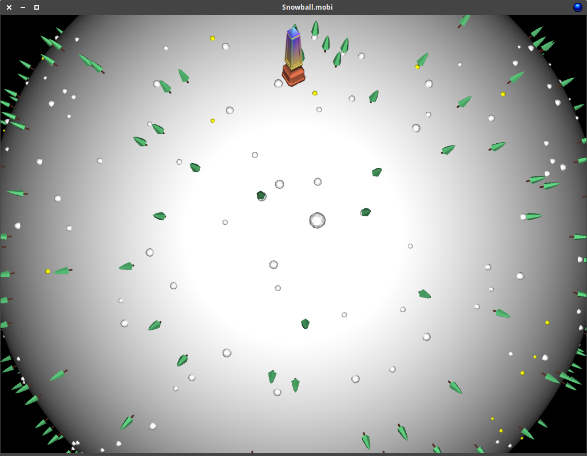

# SNOWBALL2
The GLFW version of Snowball.mobi with MSAA.

This is probably going to be a slow progress project as it's not a priority or a passion project of mine at the moment, essentially I wanted to try out [GLFW](https://www.glfw.org/) and decided that porting [Snowball.mobi](https://github.com/mrbid/Snowball.mobi) to GLFW would be a good test case.

Generally I really like GLFW, although it has no default audio support like SDL has, GLFW feels like a better portable framework to be using for OpenGL. Also, audio support in SDL2 probably wont be as good as utilising [PortAudio](http://www.portaudio.com/).

At the moment this is a direct port of the original Snowball game, but the plan would be to radically improve upon the old version.

GLFW 16x MSAA | SDL2 GLES NO MSAA
:-------------------------:|:-------------------------:
 | 

The original Snowball.mobi never had MSAA because it was designed to be a OpenGL ES / WebGL game and MSAA is not technically supported, or a great idea to be using on low end devices. The idea of porting Snowball to GLFW is to take advantage of all the features OpenGL has to offer.

## TODO
- GL Menu System
- Audo system
- Particle effects
- Smoother rotation transitions
- Better timings, use polynomial for snowball rotation speed possibly.
- Depreciate esAux for vec/mat or linmath.

The shader program... Well this time I am going to make one shader program which executes all four of the shading modes that I make use of. Why? Well if this article is anything to go by _(which I hope it is)_ [GPU inner workings](https://vksegfault.github.io/posts/gentle-intro-gpu-inner-workings/) then technically these if statement switches would be inter-subgroup branching and not intra-subgroup branching which means that when all threads execute they will all be executing the same branches/pathways. In the past my belief was that no branching in shaders should be performed if possible, and I am sure there is still truth to this statement but Snowball is not Crysis and inter-subgroup branching is probably going to be just fine.

## Prerequisites
`sudo apt install libglfw3 libglfw3-dev`

## Linux Binary
https://github.com/mrbid/SNOWBALL2/raw/main/snowball
